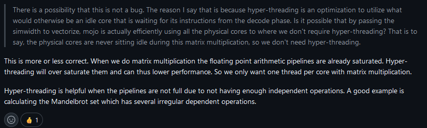

# TO RUN
To run (https://docs.modular.com/mojo/manual/get-started):
- install magic:  
`curl -ssL https://magic.modular.com/deb10f44-b107-4039-ad94-fb1bea11cd96 | bash`
- add it to the path
- type `magic shell` or `magic install`
- use `magic run mojo mandelbrot.mojo` to run the script
- plot.py draws a benchamrk plot

# NO HYPERTHREADING SUPPORT

https://github.com/modular/mojo/issues/1877